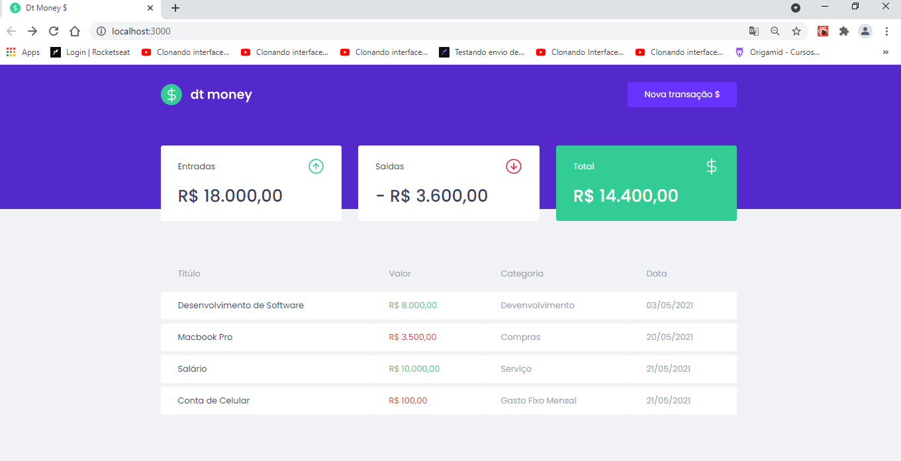
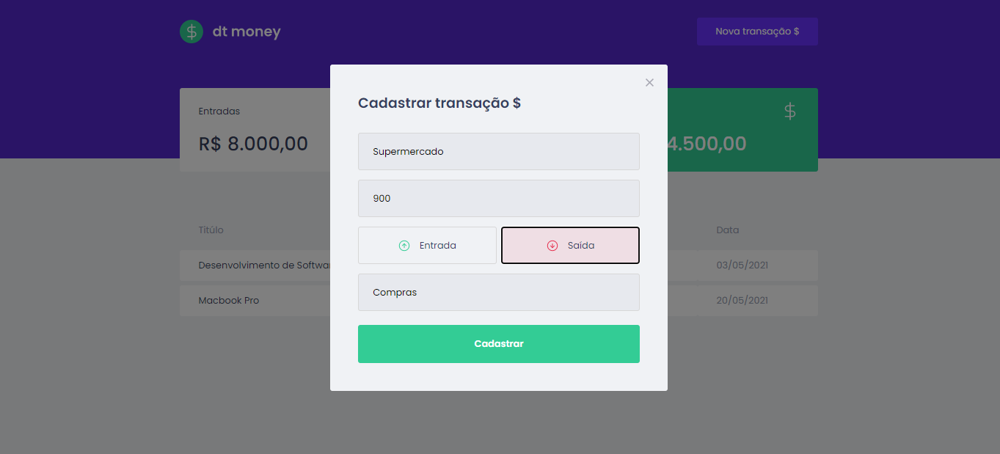

<h1 align="center">
dt mney  </h1>

## 💻 Projeto:
Primeiro projeto desenvolvido durante o bootcamp da Rocketseat pelo Ignite - trilha ReactJS. 
DT Money é uma aplicação para controle de gastos financeiros. É possível cadastar entrandas e saídas e ver o valor respectivo, de saídas, de entradas e do total.

## 🚀 Tecnologias: 

    As seguintes tecnologias foram usadas no desenvolvimento dessa aplicação:
    <ul>
      <li><a href="https://pt-br.reactjs.org/">ReactJS</a></li>
      <li><a href="https://pt-br.reactjs.org/docs/hooks-intro/">React Hooks</a></li>
      <li><a href="https://www.typescriptlang.org/">TypeScript</a></li>
      <li><a href="https://styled-components.com/">Styled components</a></li>
      <li><a href="https://miragejs.com/">Mirage.js</a></li>
      <li><a href="https://www.npmjs.com/package/axios/">Axios</a></li> 
    </ul>
  

## :octocat: Para executar o projeto localmente basta clonar este repositório: 

`git clone https://github.com/zehigor10/dtmoney-first-project-reactjs.git`

<h3> Acesse o :open_file_folder: diretório reactjs-dtmoney </h3>

`cd reactjs-dtmoney`

<h3> Instale todas as :books: bibliotecas presentes no projeto com o comando: </h3>

`yarn`

 <h3> Agora basta executar o projeto :tada: </h3>
 
 `yarn start`
 
O projeto irá rodar no endereço: <a> http://localhost:3000 </a> 
